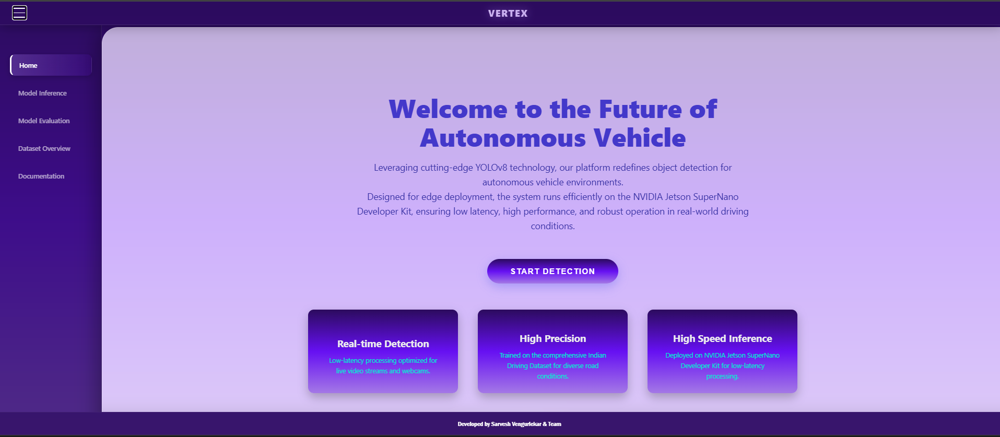
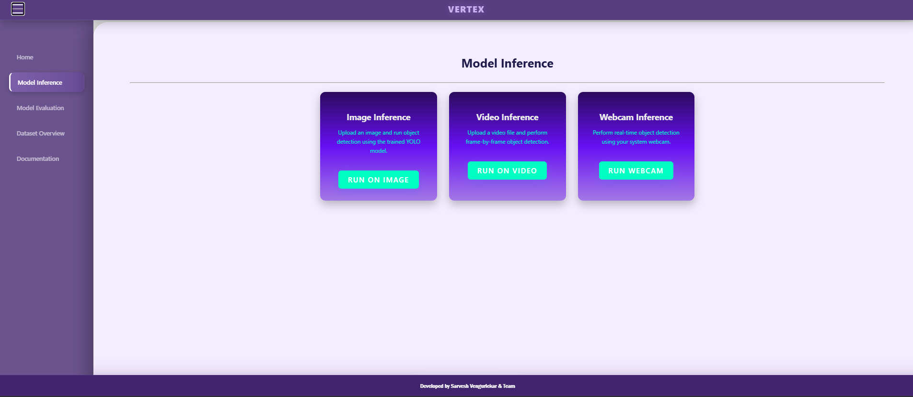
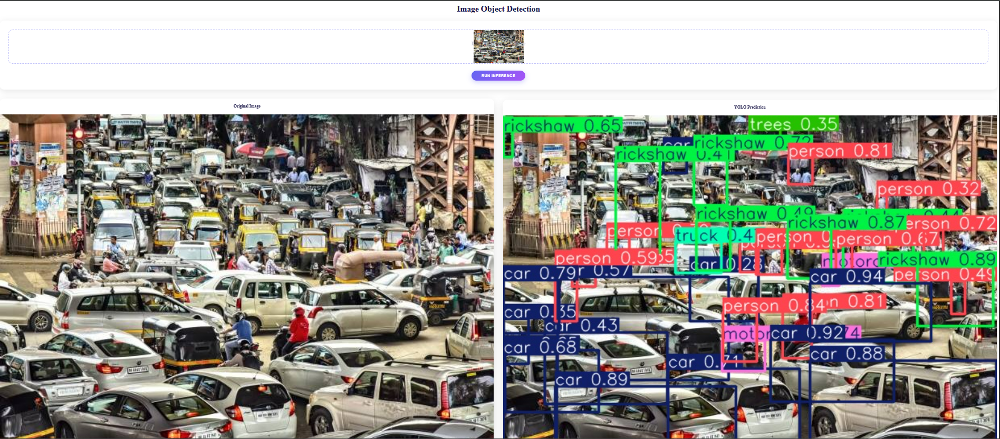

# Vertex - Autonomous Vehicle Object Detection

Vertex is a cutting-edge object detection platform designed for autonomous vehicle environments. Leveraging the power of **YOLOv8**. It provides real-time, high-precision detection of road objects.

## **Home Page**


## **Model Inference Page**


## **Image Inference Page**


## 🚀 Features

- **Real-Time Detection**: Low-latency processing optimized for live video streams.
- **Multiple Inference Modes**:
  - **Image Inference**: Upload and analyze static images.
  - **Video Inference**: Process video interactions with playback support.
  - **Webcam Inference**: Live detection using connected cameras.


- **Relevant Dataset Training**: Trained on the comprehensive Indian Driving Dataset (IDD) for diverse road conditions.
- **Model Evaluation**: Built-in tools for evaluating model performance.
- **User-Friendly Interface**: Modern, responsive UI built with **Flask** and **Vue.js**.

## 🛠️ Technology Stack

- **Backend**: Flask (Python)
- **Frontend**: HTML5, CSS3, Vue.js
- **Computer Vision**: OpenCV, Ultralytics YOLOv8
- **Machine Learning**: PyTorch

## 📋 Installation

1. **Clone the repository**
   ```bash
   git clone <repository-url>
   cd <repository-directory>
   ```

2. **Install Dependencies**
   Ensure you have Python 3.8+ installed. It is recommended to use a virtual environment.
   ```bash
   pip install -r requirements.txt
   ```

3. **Download Model Weights**
   Ensure the YOLO model weights are placed in the `model/` directory.
   - Expected path: `model/20_best.pt`

## 🏃 Usage

1. **Start the Application**
   ```bash
   python app.py
   ```

2. **Access the Dashboard**
   Open your web browser and navigate to:
   ```
   http://localhost:4000
   ```

3. **Navigate the Interface**
   - Use the **Sidebar** to switch between Home, Inference, Evaluation, and Docs.
   - **Home**: Overview and feature highlights.
   - **Model Inference**: Choose between Image, Video, or Webcam detection modes.
   - **Dataset Overview**: Information about the training data.

## 📂 Project Structure

```
├── app.py                 # Main Flask application entry point
├── requirements.txt       # Python dependencies
├── model/                 # Directory for YOLO model weights
│   └── 20_best.pt        # Pre-trained model file
├── inference/             # Inference logic and web resources
│   ├── image.py          # Image inference logic
│   ├── video.py          # Video processing logic
│   ├── webcam.py         # Webcam streaming logic
│   ├── templates/        # HTML templates for the UI
│   ├── static/           # Static assets (CSS, JS, images)
│   └── uploads/          # Directory for uploaded files
└── runs/                  # YOLO training/inference run logs (generated)
```

## 🤝 Credits

**Developed by:** Sarvesh Vengurlekar & Team

